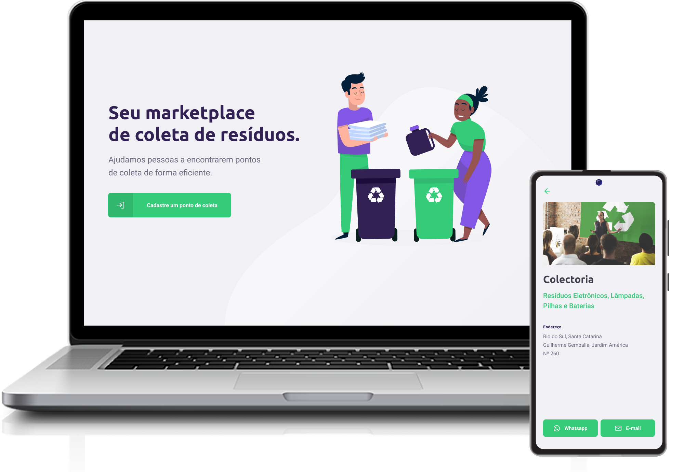

<h1 align="center">
  
</h1>

 

  

  

## :computer: Projeto

O Ecoleta é um marketplace que ajuda pessoas a encontrarem pontos de coleta de resíduos de forma eficiente.

## :zap: Tecnologias

* [React.js](https://pt-br.reactjs.org)
* [React Native](https://reactnative.dev)
* [Expo](https://expo.dev)
* [TypeScript](https://www.typescriptlang.org)
* [Node.js](https://nodejs.org)

## :bookmark: Layout

O protótipo da versão Web & Mobile se encontra no link abaixo:

* [Protótipo - Figma](https://www.figma.com/file/7bppDHWvofhCxpJ0aE13X9/Ecoleta)

## :reminder_ribbon: License

Este projeto está sob a licença MIT. Veja o arquivo [LICENSE](LICENSE.md) para mais detalhes.